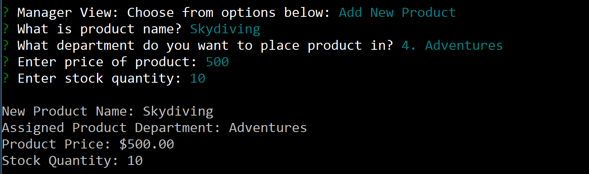

## Overview
Bamazon is like an Amazon-like storefront (but with a lot less money and not as complex). The app will take in orders from customers and deplete stock from the store's inventory. Also, track product sales across your store's departments and then provide a summary of the highest-grossing departments in the store.

### Customer View (bamazonCustomer)
As soon as the customer gets to Bamazon, there is a list of products available for offering. The customer can enter the id number to select what product to purchase.

If the customer enters and item id number that does not exist, they will get the following response:

Otherwise if they enter in a valid id number, they will be prompted to enter a quantity amount (which also has its own validation associated to it). Anyways, once they have entered a valid quantity and id number, it will show them a summary of the purchase.

In the background, other things are occurring as well. Total revenue gets updated as well as stock inventory. We can see these changes reflected in the other modules. 

Finally, they can buy more by entering "yes", but if they enter "no" their shopping experience has come to an end (for the time being)

### Manager View (bamazonManager)
Within the manager level view, they have 5 options:
1. View Products for Sale
2. View Low Inventory
3. Add to Inventory
4. Add New Product
5. Log Off

#### View Products for Sale
This will show product ID, product name, product price and product quantity.

#### View Low Inventory
This will show all products that have less than 5 items in inventory, which in this case will show nothing, as everything is stocked above that threshold at the current time.

#### Add to Inventory
This allows manager to add inventory to any current product. Note, there is also validation to ensure proper values of inventory are added (user can only add integers and can not enter in anything non-numeric). Once user adds in information, it will inform user the update to inventory.

#### Add New Product
This allows the manager to add a new item to the product list. Once the user enters in valid information and confirms that they want to add item, it will then be added to the database.

### Supervisor View (bamazonSupervisor)
This allows the supervisor to do two things:
1. View Product Sales by Department
2. Create New Department

#### View Product Sales by Department
In this we take information from both the product and department table to get a view of the following: Department ID, Department Name, Overhead costs, Total Sales, and profit.

#### Create New Department
In this, the supervisor can add a new department name as seen in the screenshot below.

### Final Note
Now that we have added a new department and some new products, we can see changes in the different modules.

There are new Products and there are even some products that have less than 5 items:

Also, there is another department in which the manager can add an item to...remember when we added "Adventures" as a new department.

And of Course, now the customer has more options to choose from!

And the Supervisory might have some more money coming in (as there are more departments). Notice the $1,000 in Adventures.

Overall, Bamazon may not be Amazon, but not bad for jumpstarting Bamazon within a week time frame while juggling multiple other responsibilities! Watch out Jeff Bezos!

